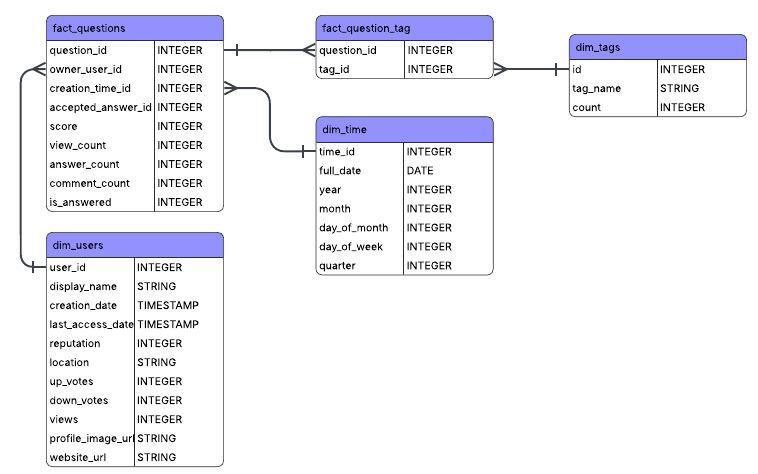

# Stack Overflow Data Insights

## Introduction

This project simulates a comprehensive technical data assessment, covering the entire analytical lifecycle from sourcing raw data to surfacing actionable insights. The focus is the **Stack Overflow public dataset**, aiming to pinpoint which topics (**tags**) demonstrate the **highest need for answers**—quantifying the gap between community demand and available resolution.

The core finding is driven by the **Demand Index**, a **synthetic metric** combining **views** with the **unresolved_questions**.

---

## 🧩 Project Architecture: Star Schema Design

The data pipeline employs a robust dimensional model to ensure optimal performance and query efficiency for reporting. The analytical schema is structured as a Star Schema, with `fact_questions` serving as the central table. 


 

| Table | Type | Description |
| :--- | :--- | :--- |
| **`fact_questions`** | Fact | Central table capturing core question metrics (views, score, `is_answered`). |
| **`fact_question_tag`** | Bridge | Links individual questions to multiple tags (many-to-many relationship). |
| **`dim_users`** | Dimension | User information, including authorship and reputation metrics. |
| **`dim_tags`** | Dimension | Tag metadata, names, and frequency of use across the platform. |
| **`dim_time`** | Dimension | Standard calendar dimension for analyzing question creation and activity dates. |

---


## 📈 Insights Visualization (Looker Studio)

The final analysis is presented in a Looker Studio dashboard:

* **Primary Visualization:** A **Horizontal Bar Chart** ranking the **Top 10 Topics** by the calculated **Demand Index**. The chart clearly shows the massive gap between user demand (views) and problem resolution.
* **Interpretation:** The x-axis scale (in thousands) shows that tags like 'favicon' and 'calculator' have a disproportionately high number of views per unresolved question (Demand Index $\approx$ 380K), indicating extreme user frustration and the most urgent need for expert answers. The accompanying table highlights the
* **Absolute Demand** for major languages (`python`, `java`, `android`), showing their total volume of unresolved questions and views.
* **Report Access:** **[Looker Studio report](https://lookerstudio.google.com/s/u6fZ0gs8I1o)**

---


### ⚙️ Environment Configuration

To successfully run this dbt project, you must configure your local credentials for Google BigQuery.

1.  **Prerequisites:** Ensure you have the necessary tools installed:
    ```bash
    pip install dbt-bigquery
    ```

2.  **Service Account Key:** Obtain a JSON key file for a Google Service Account that has, at minimum, the `BigQuery Data Editor` and `BigQuery Job User` roles within your GCP project.

3.  **Configure `profiles.yml`:** Create or update your local `~/.dbt/profiles.yml` file with the configuration structure shown in Step 1 (the environment variable-based configuration).

4.  **Set Environment Variables:** Before running any dbt command, set the required environment variables in your terminal session. Replace the placeholder values with your actual data:
    ```bash
    # Set the absolute path to your downloaded Service Account JSON key
    export DBT_BIGQUERY_KEYFILE="/home/user/path/to/your/keyfile.json"
    
    # Set your GCP Project ID (where the tables will be built)
    export DBT_TARGET_PROJECT="your-gcp-project-id"
    
    # Optional: Set the target BigQuery dataset (schema) name
    export DBT_TARGET_DATASET="dbt_so_insights_dev" 
    ```

### Running the Project

Once the environment variables are set, you can run the project from the root directory (`stack_overflow_insights/`):

```bash
dbt deps     # Installs any necessary dbt packages
dbt debug    # Verifies the connection and configuration
dbt build    # Executes all models in the correct order

2.  Install dbt packages: `dbt deps`
3.  Build the data model: `dbt build`

The fully transformed analytical tables will be created in your target BigQuery dataset.
